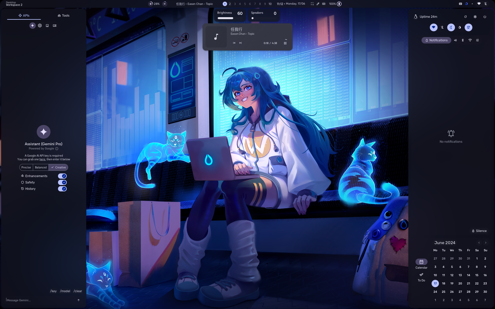

# Neko Linux

NekoLinux is a distribution based on Artix Linux.

# Warning!!!
NekoLinux is not recommended for non-professionals. Use at your own risk. The developers are not responsible for any data loss, damage, or other issues that may arise from using this system.

## Default Credentials
- **Username:** neko
- **Password:** neko

For more screenshots, please see [dots-hyprland](https://github.com/end-4/dots-hyprland). This system has not modified any configurations of dots-hyprland.

## Important Notes
- **VMware Users:** If you are using VMware to start this system, please enable 3D acceleration.
- **Ventoy Users:** The image cannot currently be booted using Ventoy.

## Known Issues
- Using screen lock in VMware causes the screen to turn red
- Playing music in VMware results in intermittent sound for about 1 minute before returning to normal
